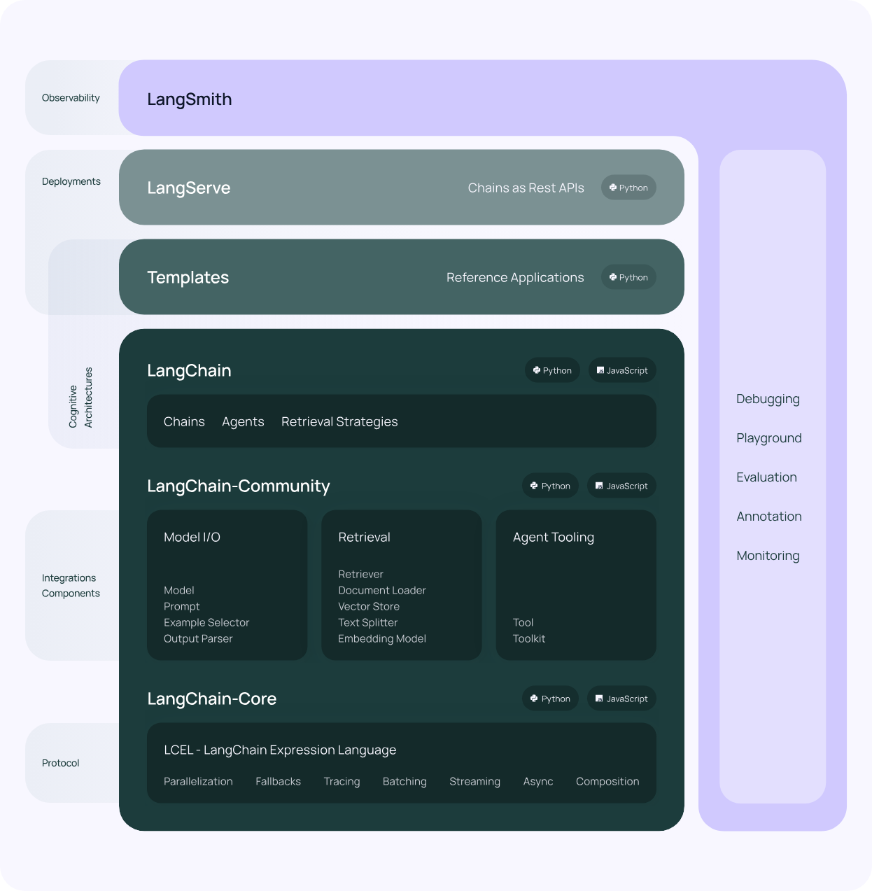

# LangChain 🧠✨

Welcome to the world of LangChain, where applications powered by large language models (LLMs) come to life! 🚀 Whether you're a seasoned developer or just getting your feet wet with LLMs, LangChain has you covered. So, buckle up and let’s dive into the wonderful world of AI magic! 🧙‍♂️

## 🌟 What Is LangChain?

LangChain is a framework designed to make your journey through developing, productionizing, and deploying LLM applications as smooth as a warm cup of coffee on a lazy morning! ☕️ It's your all-in-one solution for creating intelligent, stateful applications powered by the power of large language models.

### 🧰 Features

- **Development**: Use LangChain's building blocks to create your dream application. With third-party integrations and templates, you'll be up and running in no time!
- **Productionization**: Monitor, inspect, and evaluate your chains using LangSmith. Optimize confidently for seamless deployment!
- **Deployment**: Transform your chain into a snazzy API with LangServe. Let's serve some chains! 🍽️

## 🛠️ Libraries and Components

LangChain is made up of a few magical ingredients:

- **langchain-core**: The foundation - like the base of a delicious pizza! 🍕 Provides base abstractions and LangChain Expression Language.
- **langchain-community**: Integrate with third-party services, making sure your application plays nice with others. A bit like the party animal of your friend group. 🎉
- **Partner Packages**: Such as `langchain-openai`, `langchain-anthropic`, and more! These packages focus on specific integrations and rely only on `langchain-core`.
- **langchain**: The heart of LangChain, with chains, agents, and retrieval strategies forming the backbone of your app's cognitive architecture.
- **langgraph**: Think of it as a treasure map for your application! Model your steps as edges and nodes to build robust, stateful multi-actor applications.
- **langserve**: Turn your chains into REST APIs that are ready to serve! Get your apron on—dinner’s ready! 🍽️

Langchain Architecture Diagram: 

## 📚 Documentation

Looking for more info? Visit our [official documentation](https://python.langchain.com/docs/get_started/introduction) for the latest tips, tricks, and in-depth guides.

